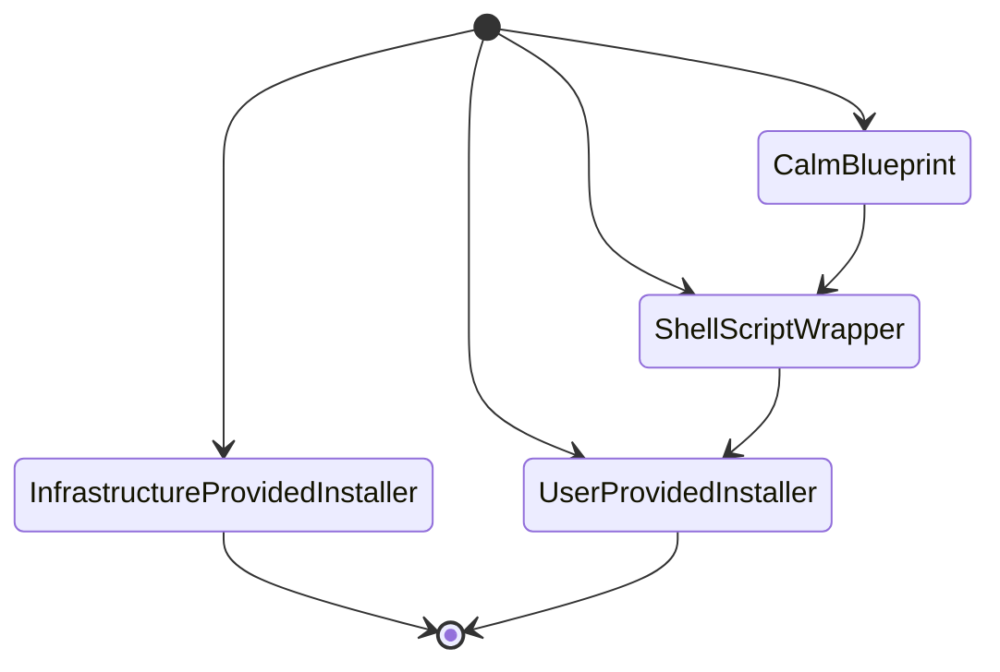

# Getting Started with Red Hat OpenShift on Nutanix

This blog series provides guidance to IT, DevOps, and system administrators looking to justify and provide production grade Kubernetes with Red Hat OpenShift on a Nutanix AHV cluster.

## Cloud Native Digital Transformation

The migration of applications from physical servers to virtual workloads has been underway for over two decades, but the migration from virtual machines to containers is less than a decade old. Modernizing applications to run as containers requires new tooling and the open source [Kubernetes project](https://kubernetes.io/) has emerged as the widest adopted container management system.

Kubernetes provides cloud-native capabilities, architecture, and operations which require new skill sets, posing a disruptive challenge to traditional organizations who desire the rapid software updates and performance scaling benefits. Like the Linux operating system, there are many Kubernetes distributions, and Red Hat [OpenShift](https://www.redhat.com/en/technologies/cloud-computing/openshift) provides a market-leading platform to build, deploy and run applications with a consistent foundation across the hybrid cloud. Red Hat OpenShift includes over-the-air updates, container runtime, networking, ingress, monitoring, logging, container registry, and authentication and authorization solutions.

Nutanix provides simplicity, scalability, and hybrid cloud infrastructure, providing one-click upgrades of storage, compute, and network resources and services on your choice of hardware, public cloud, and service providers. Running Red Hat OpenShift on Nutanix provides a full stack, enterprise supported, standardized solution with greatly simplified platform management and many non-disruptive operations, accelerating the adoption of containers and cloud native applications.

## Partnership Overview

Red Hat, the leading open source software vendor, and Nutanix, the pioneering hyperconverged infrastructure leader, [announced a strategic partnership in July 2021](https://www.nutanix.com/blog/red-hat-and-nutanix-partner-to-deliver-big-on-hybrid-cloud) which supports recent releases of Red Hat Enterprise Linux, Satellite, and OpenShift on Nutanix AOS with AHV hypervisor. Customers have asked for improved support, certification, and reference architectures from Red Hat and Nutanix and joint engineering work has been underway for most of 2021.

    “The insurance industry is in the midst of a transformation to rapidly adapt to customers’ demands. We protect 39 million lives around the world with our products and services. As we work to modernize our IT infrastructure to support a seamless digital experience for our customers and employees, Nutanix and Red Hat help simplify our technology stack and advance our cloud transformation.”
    [Gautam Roy, chief technology officer, Unum](https://www.redhat.com/en/about/press-releases/red-hat-and-nutanix-announce-strategic-partnership-deliver-open-hybrid-multicloud-solutions)

An overview of the technology stack powering Red Hat OpenShift on Nutanix HCI solution includes workloads and orchestration on the top layer, the combined Nutanix and Red Hat software offerings in the middle layers, and the infrastructure providers (on-premises hardware and public clouds) on the bottom layer. In the following diagram, the Nutanix supported portion of the solution is indicated in green.

[Prism](https://www.nutanix.com/products/prism) is the Nutanix control plane, a single pane of glass web console for managing multiple Nutanix clusters running the Nutanix [AHV](https://www.nutanix.com/products/ahv) hypervisor on [AOS](https://www.nutanix.com/products/acropolis/distributed-storage), Nutanix's data plane for storage and cluster operations. On a Nutanix AHV cluster, Red Hat OpenShift and Nutanix data services run as virtual machines.

While there is much potential for the partnership to expand, the focus of this series is to walk through and exercise a full-stack, enterprise-supported Kubernetes container platform with OpenShift on Nutanix AHV.

## Why Use Nutanix for Cloud Native Solutions?

Nutanix supports multiple infrastructure vendors and hyperscalers, hypervisors, and Kubernetes distributions. Customers can leverage many of their existing vendors, investments, and skill sets while modernizing their operations and reducing total cost of ownership with [Nutanix HCI](https://www.nutanix.com/products/acropolis) to provide enterprise clouds. Nutanix Prism consolidates, simplifies, and can automate the management of compute, storage, GPU, and network infrastructure for multiple Nutanix AHV clusters. Most Nutanix offerings include "one-click" enablement, scale out expansion, non-disruptive upgrades, and [OpenAPIs](https://www.nutanix.dev/api-reference-v3/) through Prism, providing a single pane of glass experience for operators and a rich cloud platform for automation.

The combination of AOS, AHV, and Prism on multiple infrastructure providers forms the basis for Nutanix data services to simplify storage for cloud-native workloads. For maximum application performance offered by Nutanix HCI, OpenShift on AHV leverages the [Nutanix CSI driver](https://artifacthub.io/packages/helm/nutanix/nutanix-csi-storage) to access Nutanix data services to consume Nutanix cluster storage with advanced management features such as backup, disaster recovery, and scale out capacity.

For persistent storage, the Nutanix CSI driver accesses block storage via iSCSI with [Nutanix Volumes](https://www.nutanix.com/products/volumes) and file storage via NFS recommended with [Nutanix Files](https://www.nutanix.com/products/files). The [Nutanix CSI operator](https://github.com/nutanix/openshift/tree/main/operators/csi) automates CSI deployment in OpenShift clusters and makes consuming Nutanix data storage services a simple operation.

A more detailed view of the architecture *(the following image is a draft, not final)*:

The above constitutes the elements of a forthcoming reference architecture, but Nutanix can provide additional facilities to support and be consumed by containerized applications. [Nutanix cloud native](https://www.nutanix.com/solutions/cloud-native) offerings can provide [object storage](https://www.nutanix.com/solutions/consolidated-storage) and [databases](https://www.nutanix.com/solutions/databases) with advanced management from Prism without migration to Kubernetes. Nutanix automation offerings provide [cluster AIOps, auditing, and reporting](https://www.nutanix.com/products/prism) as well as [application self-service, governance, and operations](https://www.nutanix.com/products/calm) for PaaS and SaaS experiences across [hybrid, public, or private cloud usage](https://www.nutanix.com/products/beam).

Nutanix pioneered the modernization of traditional three tier architecture with hyper-converged infrastructure and AOS, AHV, and Prism are built on cloud-native facilities to provide a seamless hybrid cloud management platform. Nutanix data services simplifies and accelerates VMs and containers for Red Hat OpenShift clusters. The combined Red Hat and Nutanix solution offers a better total cost of ownership, a standard certified full-stack, and joint enterprise support for OpenShift on AHV.

The next entry in the blog series will begin the walkthrough of installing Red Hat OpenShift on a Nutanix AHV cluster.

---

## OpenShift on AHV Installation Choices

The initial support and certification offering focuses on the following:

- Two recent Nutanix AOS LTS (Long Term Stability) releases with AHV:
  - 5.15.6
  - 5.20.1
- Recent Red Hat OpenShift releases:
  - 4.6
  - 4.7
  - 4.8

Older releases of AOS, AHV, and OpenShift will not be supported. Successive patch and forward compatible releases will continue to support OpenShift on AHV. New releases are expected to be supported in the future, *this is a forward looking statement*. Consult the Nutanix Support portal, Compatibility and Interoperability Matrix, [Partner Software](https://portal.nutanix.com/page/documents/compatibility-interoperability-matrix/software) tab and filter on **Partner Name:** Red Hat for updates.

The OpenShift installer for platform agnostic **user-provisioned infrastructure**  is used. As the Red Hat and Nutanix partnership evolves, progressively easier and faster automation solutions for **installer-provisioned infrastructure** clusters will be supported, leading to turn-key OpenShift clusters, *this is a forward looking statement*. For customers interested in early access, please contact a local Nutanix representative to learn more.

## Installation Walk Through

Prerequisites are detailed in the Nutanix engineering [public OpenShift documentation Git repository](https://github.com/nutanix/openshift/tree/main/docs/install/manual), but a brief summary (September 2021) includes:

1. [Red Hat Customer Portal](https://access.redhat.com/) account
2. Nutanix AHV cluster with available resources:
   - Minimal OpenShift cluster:
     - Control pane: 3 VMs (4 vCPU, 16 GB RAM, 100 GB storage)
     - Worker pane: 2+ VMs (2 vCPU, 8 GB RAM, 100 GB storage)
     - 48GB RAM = (3x16 + 2x8) total
     - 500GB storage = 100*(3+2) total
     - 16 vCPU = 3x4 + 2x2 total
     - vCPU = physical core or (threads per core × cores) × sockets
   - Network with:
      - Outbound public Internet access (to access.redhat.com and quay.io)
      - Upstream NTP access
      - Upstream DNS access
        - ideally with hostnames for OpenShift cluster VMs, can be bypassed by DHCP
      - DHCP with a routable subnet for the openshift cluster VMs:
        - with persistent leases or 5 static IP addresses if DHCP unavailable
        - upstream NTP and DNS configuration
    - API and Application ingress load balancers (HAProxy)
      - Can be combined, but must have upstream (external) and internal subnet routing
3. Installation host: a Linux VM or Linux/MacOS computer with:
   - *Approximately 2 GB storage* for OpenShift binaries and configuration
   - Outbound public Internet access
   - Network access to Nutanix AHV cluster
   - 4 vCPU, 16 GB RAM, 100 GB storage
4. *CSR signing and SSH keypair(s)*
5. Kubernetes manifest and Ignition configuration files to bootstrap RHCOS nodes

This walk through does not cover dark site, off-line, or disconnected public network access installation of OpenShift. While optional, leveraging a Linux VM on the AHV cluster for the installation host minimizes network transfer and is recommended and can be sized as an additional control pane node. Private network access between the installation host and Nutanix AHV cluster is also recommended.

[walk through continues...]

Requirements from:
- https://docs.openshift.com/container-platform/4.8/installing/installing_bare_metal/installing-bare-metal.html#installing-bare-metal
- https://access.redhat.com/documentation/en-us/red_hat_openshift_container_storage/4.8/html-single/planning_your_deployment/index#resource-requirements_rhocs
- https://access.redhat.com/documentation/en-us/red_hat_openshift_container_storage/4.8/html-single/planning_your_deployment/index#storage-device-requirements_rhocs ?
From Shane:
https://www.redhat.com/rhdc/managed-files/cl-self-managed-openshift-sizing-guide-f28271pr-202105-en_0.pdf
https://docs.openshift.com/container-platform/4.8/installing/installing_vsphere/installing-vsphere.html#minimum-resource-requirements_installing-vsphere
---
Part 1 intro: https://docs.google.com/document/d/15EQ9mr8CWuXcywhwts5kV3p7JmE38kKQiEi-ilU-uy4/edit?usp=sharing

https://raw.githubusercontent.com/mlavi/openshift/main/docs/install/walkthrough/openshift-on-hci.png

Sidebar ideas:

- “Platform agnostic User Provisioned Infra” and better why NTNX, AHV as a KVM fork, etc.
- Nutanix and Open Source? Nutanix and Kubernetes?
- How is Nutanix Licensed?
  - non-CSI usage requires Nutanix Volumes licensing
  - Nutanix Files (license not included)
- Reference arch:
  - A Nutanix AHV cluster with Red Hat OpenShift should be provisioned with resource capacity for container workloads, Nutanix and Red Hat OpenShift, and redundancy overhead to prevent downtime due to failures.
  - Compute, memory, storage, and GPU local resource capacity for container workloads, plus the resources required by Nutanix AOS, AHV, Prism and Red Hat OpenShift overhead, which would include local cluster storage for AHV image, VM, and container instantiation.
- Cluster API, K8s Federation, Operator framework
-
---
Non-sales webinars:
- How to accelerate on-prem OpenShift? how to be your own MSP/public cloud SaaS?
- How to cut OpenShift costs? TCO
modernization, hybrid/multicloud/managing workloads across multiple cloud, and cloud costs

# Getting Started with Red Hat OpenShift on Nutanix
Blog Series Outline
1. Overview of Red Hat OpenShift on Nutanix HCI Solution
Digital transformation with Kubernetes requires new skills, architecture, and operations, but how do organizations address the multitude of choices required to work together to achieve application modernization? Red Hat and Nutanix have unified to make the OpenShift Container Platform run on Nutanix hybrid cloud infrastructure with joint enterprise support, simplified management, and scalable data services for cloud native workloads. A review of the solution components and how they make IT operations easier.

2. Preparation for OpenShift Installation
A walk through of product enablement, dependent services, and configuration on a Nutanix AHV cluster for OpenShift Container Platform network, storage, compute, and security resource requirements to insure a successful installation.

3. OpenShift User Provisioned Infrastructure Installation
Guidance for design choices to get OpenShift configured and running with Nutanix data services for persistent container workloads.

4. Deploying a Sample Application on OpenShift
Administrative walk through to provision resources in OpenShift with a sample application on a Nutanix AHV cluster.

Deployment Options
1. UPI: (Platform agnostic) User Provisioned Infra (sometimes referred to as bare metal option)
2. IPI: Installer Provisioned Infra (https://github.com/openshift/enhancements/pull/912)
3. Automation:
   1. Calm blueprint: adds provisioning + install wrapper UPI
   2. Shell scripts: installer wrapper UPI?
   3. https://cloud.redhat.com/openshift/assisted-installer/clusters/ requires VPC
      https://github.com/openshift/assisted-service

---
Calm blueprint: 4.7
- ssh -i ~/Documents/github.com/mlavi/dotfiles/keys/calm-blueprints.key core@10.42.250.94
