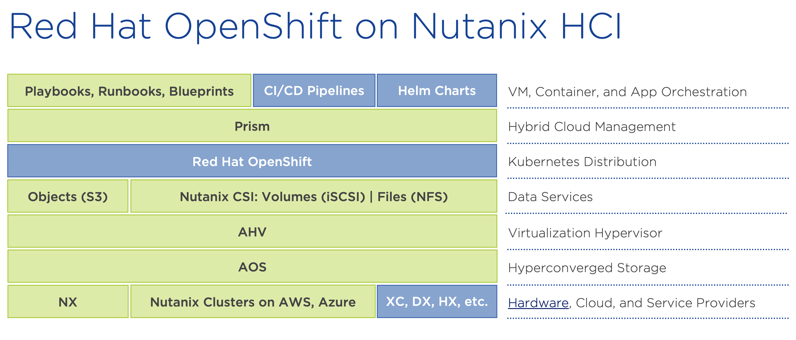
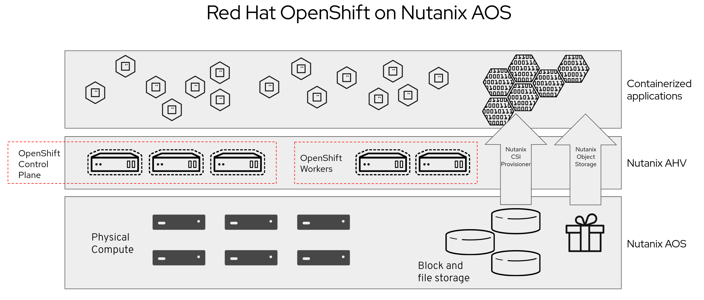
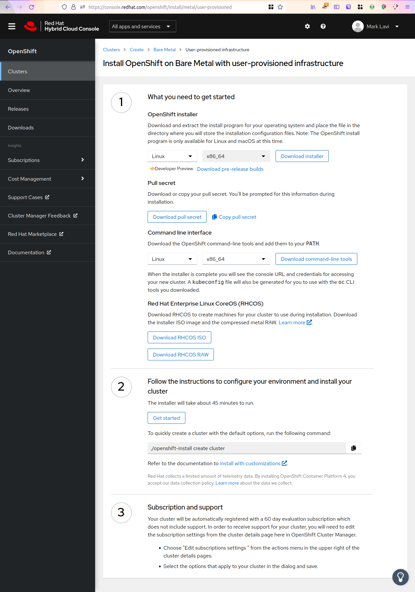

# Installing Red Hat OpenShift on a Nutanix AHV Cluster

## Cloud Native Digital Transformation

The migration of applications from physical servers to virtual workloads has been underway for over two decades, but the migration from virtual machines to containers started less than a decade ago. Modernizing applications to run as containers requires new management systems and the open source [Kubernetes project](https://kubernetes.io/) has emerged as the leader.

Kubernetes provides cloud-native capabilities, architecture, and operations which require new skill sets, posing a disruptive challenge to traditional organizations. Like the Linux operating system, there are many Kubernetes distributions, and Red Hat's OpenShift Container Platform provides a market leading, rich featured, secure manner to run and manage containers. OpenShift includes over-the-air updates, container runtime, networking, ingress, monitoring, logging, container registry, and authentication and authorization solutions. Combining Red Hat OpenShift with Nutanix hybrid cloud infrastructure provides a full stack enterprise supported solution with simplified management and operations, accelerating the adoption of containers and cloud native applications.

## Partnership Overview

Red Hat and Nutanix [announced a strategic partnership in July 2021](https://www.nutanix.com/blog/red-hat-and-nutanix-partner-to-deliver-big-on-hybrid-cloud) which supported recent releases of Red Hat Enterprise Linux, Satellite, and OpenShift on Nutanix AOS with AHV hypervisor on Hyperconverged Infrastructure (HCI) providers for hybrid clouds. The combined strength of the best open source software leader with the best hybrid cloud infrastructure leader has been asked by our mutual customers for years and work to improve jointly certified solutions has been underway for most of 2021. *[Customer quote links from the PR?]*

A simple overview of the joint solution: 

While there is much potential for the partnership to expand, the focus of this series of blogs is to walkthrough and exercise a full stack, enterprise supported Kubernetes container platform with OpenShift on AHV.

## Why Use Nutanix HCI, Data Services, and Cloud Native Solutions?

Freedom of customer choice is central to Nutanix, with support for multiple infrastructure vendors and hyper-scalers, hypervisors, and Kubernetes distributions. Choice allows customers to leverage their existing vendors, investments, and skill sets while modernizing their operations and reducing total cost of ownership with [Nutanix HCI](https://www.nutanix.com/products/acropolis) to provide enterprise clouds. Further efficiencies including increased performance and reduced management can be achieved with additional Nutanix data service and cloud native offerings. Most Nutanix offerings include "one-click" enablement and upgrades, scale out expansion, and [OpenAPIs](https://www.nutanix.dev/api-reference-v3/) through the Nutanix Prism control plane, providing a single pane of glass experience for operators and a rich cloud platform for automation.

An overview of technology stack powering Red Hat OpenShift on Nutanix HCI solution includes workloads and orchestration on the top layer, the combined Nutanix and Red Hat software offerings in the middle layers, and the infrastructure providers (on-premises hardware and public clouds) on the bottom layer. In the following diagram, the Nutanix supported portion of the solution is indicated in green.

Prism is the Nutanix control plane, a single pane of glass for managing multiple Nutanix clusters that run the Nutanix AHV hypervisor on AOS, Nutanix's data plane for storage and cluster operations. On the Nutanix AHV cluster, Red Hat OpenShift and Nutanix data services run as virtual machine workloads.

A [Nutanix AHV cluster](https://www.nutanix.com/products/ahv) with Red Hat OpenShift should be provisioned with compute, memory, and GPU local resource capacity for container workloads, plus the resources required by Nutanix AOS, AHV, Prism and Red Hat OpenShift overhead, which would include local cluster storage for AHV image, VM, and container instantiation. While additional remote storage may be used by any VM, container, or Kubernetes cluster, it incurs a performance and management cost that can be mitigated when provided by Nutanix data services to local cluster storage to confer further HCI simplification. Therefore, OpenShift on AHV includes container storage interface (CSI) options from the Nutanix data services portfolio with some included usage via the [Nutanix CSI driver](https://artifacthub.io/packages/helm/nutanix/nutanix-csi-storage). Nutanix data services are additional licenses, typically with a storage dimension, to consume Nutanix cluster storage through new protocols while offering advanced management features such as backup, disaster recovery, and scale out capacity.

Persistent storage of container workloads for block storage is included and can use the Nutanix CSI driver to access local *[versus any?]* Nutanix AOS cluster via iSCSI protocol with Nutanix Volumes, but non-CSI usage requires [Nutanix Volumes](https://www.nutanix.com/products/volumes) licensing. The Nutanix CSI driver can also leverage file storage via the NFS protocol recommended with [Nutanix Files](https://www.nutanix.com/products/files) (license not included). Additionally, the [Nutanix CSI operator](https://github.com/nutanix/openshift/tree/main/operators/csi) can be leveraged from the OpenShift Marketplace

A more detailed view of the architecture *(the following image is a draft, not final)*:

The above constitutes the elements of a forthcoming reference architecture document, but the Nutanix platform has more facilities regularly consumed by containerized applications. [Nutanix cloud native](https://www.nutanix.com/solutions/cloud-native) offerings can provide [object storage](https://www.nutanix.com/solutions/consolidated-storage) and [databases](https://www.nutanix.com/solutions/databases) with advanced management from Prism without migration to Kubernetes. Nutanix automation offerings provide [cluster AIOps, auditing, and reporting](https://www.nutanix.com/products/prism) as well as [application self-service, governance, and operations](https://www.nutanix.com/products/calm) for PaaS and SaaS experiences across [hybrid, public, or private cloud usage](https://www.nutanix.com/products/beam). The Nutanix cloud platform simplifies and accelerates Red Hat OpenShift clusters for joint customers with the best enterprise support.

## OpenShift on AHV Installation Choices

The initial support and certification offering focuses on the following:

- Two recent Nutanix AOS LTS (Long Term Stability) releases with AHV:
  - 5.15.6
  - 5.20.1
- Two recent Red Hat OpenShift releases:
  - 4.7
  - 4.8

Older releases of AOS, AHV, and OpenShift will not be supported. Successive patch and forward compatible releases will continue to support OpenShift on AHV. New releases are expected to be supported in the future, *this is a forward looking statement*.

The OpenShift installer for platform agnostic **user-provisioned infrastructure** on bare metal is used. As the Red Hat and Nutanix partnership evolves, progressively easier and faster automation solutions for **installer-provisioned infrastructure** clusters will be supported, leading to turn-key OpenShift clusters, *this is a forward looking statement*. For customers interested in early access, please contact a local Nutanix representative to learn more.

## Installation Walk Through

Prerequisites are detailed in the Nutanix engineering [public OpenShift documentation Git repository](https://github.com/nutanix/openshift/tree/main/docs/install/manual), but a brief summary (September 2021) includes:

1. [Red Hat Customer Portal](https://access.redhat.com/) account
2. Nutanix AHV cluster with available resources:
   - *Approximately X memory, Y storage, Z network resources* for a minimal OpenShift cluster
   - Outbound public Internet access
3. Installation host: a Linux VM or computer or a MacOS computer with:
   - *Approximately 2 GB storage* for OpenShift binaries and configuration
   - Outbound public Internet access
4. *SSH keypair(s)?*

This walk through does not cover dark site, off-line, or disconnected public network access installation of OpenShift. While optional, leveraging a Linux VM on the AHV cluster for the installation host minimizes network transfer and is recommended. Private network access between the installation host and Nutanix AHV cluster is also recommended.

[walk through continues...]

---

Sidebar ideas:

- Nutanix and Open Source? Nutanix and Kubernetes?
